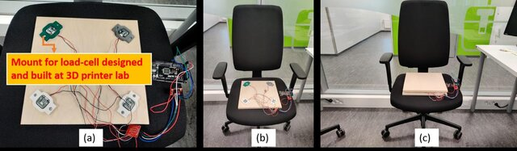
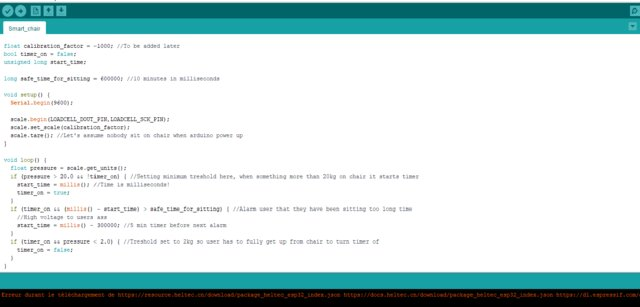

# IoTSmartChair

In this repository, the super basic code of the system can be seen. It was done through the Arduino IDE as the file can be uploaded there.
The main logic of the system is that it initiates and starts looping to see if anyone is activating the device's timer system.
Whenever the timer is exceeded a message will be sent to inform the user.

The publication of this project can be found on ResearchGate as well.

The loadcell sensors mount 3D models have been designed for this type of sensor. The mounts were printed and modeled specifically for this project.

Picture of the code:

